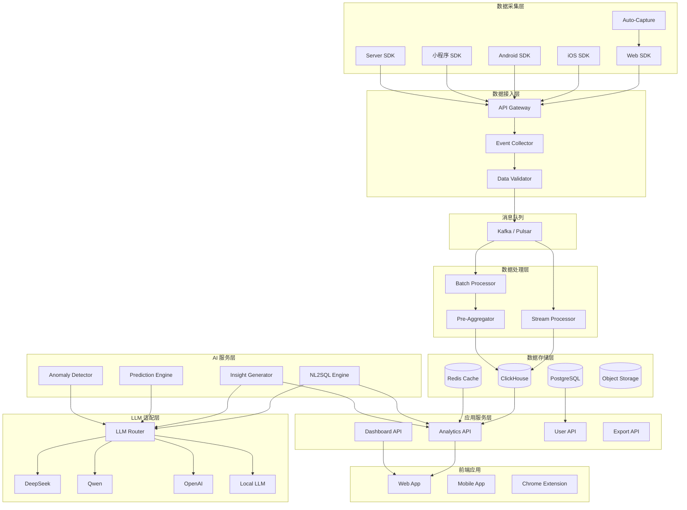
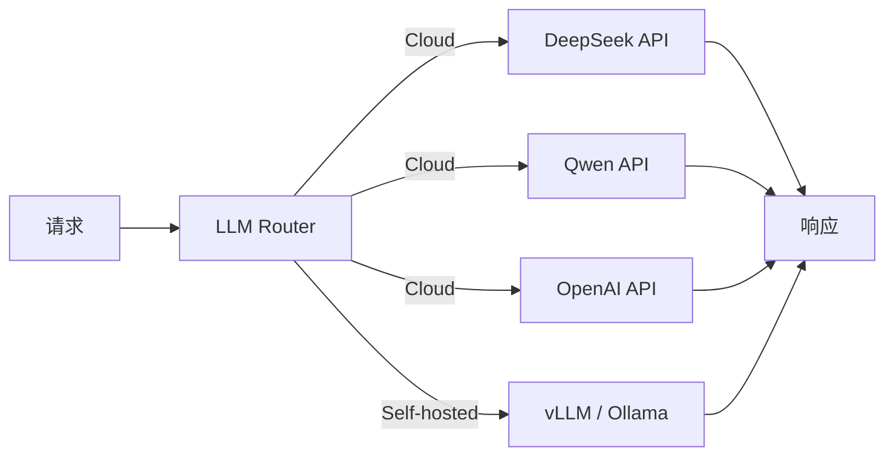
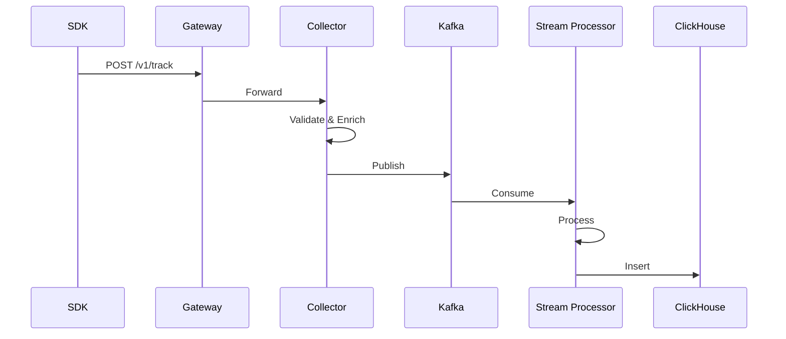
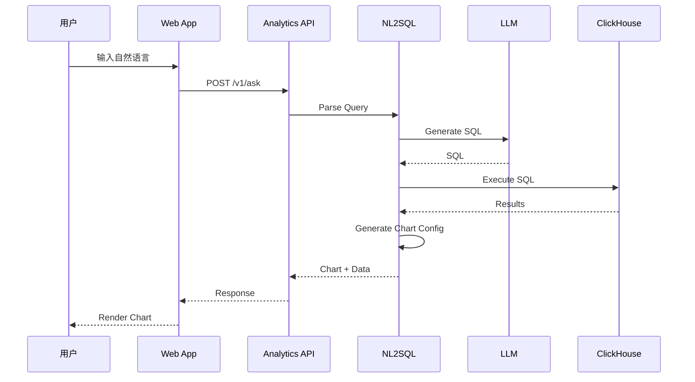
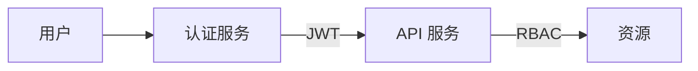

# Data Wings - 系统架构

**版本**: v1.0
**日期**: 2025-01-28
**作者**: 架构师
**PROJECT_DIR**: `/Users/mauricewen/Projects/09-data-wings`

---

## 1. 架构概述

### 1.1 系统定位

Data Wings 是一个 **AI-Native 的开源数据分析平台**，核心能力包括：

- 自然语言查询（NL2Analytics）
- 自动埋点（Auto-Capture）
- 自动洞察生成
- 预测分析
- 可视化仪表盘

### 1.2 架构原则

| 原则 | 说明 |
|------|------|
| **AI-First** | AI 能力作为一等公民，贯穿全链路 |
| **开源核心** | 核心分析引擎 MIT 开源 |
| **云原生** | 容器化、K8s 友好、弹性伸缩 |
| **国产化** | 支持国产 LLM、私有化部署 |
| **可观测** | 全链路追踪、指标监控 |

---

## 2. 系统架构图



---

## 3. 核心组件

### 3.1 数据采集层

| 组件 | 技术选型 | 职责 |
|------|----------|------|
| Web SDK | TypeScript | 浏览器端事件采集 |
| iOS SDK | Swift | iOS 应用事件采集 |
| Android SDK | Kotlin | Android 应用事件采集 |
| 小程序 SDK | JavaScript | 微信/支付宝小程序 |
| Server SDK | Python/Node/Go | 服务端事件上报 |
| Auto-Capture | DOM 监听 | 自动捕获点击/页面/表单 |

**SDK 设计要点**：
- 体积轻量：Web < 30KB gzip
- 离线缓存：断网时本地存储
- 批量上报：减少网络请求
- 数据压缩：gzip 压缩传输

### 3.2 数据接入层

| 组件 | 技术选型 | 职责 |
|------|----------|------|
| API Gateway | Kong / APISIX | 流量入口、限流、鉴权 |
| Event Collector | Go | 事件接收、格式化 |
| Data Validator | Go | 数据校验、过滤 |

**接入性能指标**：
- QPS: 100K+
- 延迟: P99 < 50ms
- 数据丢失率: < 0.01%

### 3.3 消息队列

| 组件 | 技术选型 | 职责 |
|------|----------|------|
| Message Queue | Kafka / Pulsar | 事件缓冲、解耦 |

**配置建议**：
- 分区数: 根据吞吐量调整
- 副本数: 3（保证高可用）
- 保留时间: 7 天

### 3.4 数据处理层

| 组件 | 技术选型 | 职责 |
|------|----------|------|
| Stream Processor | Flink / Kafka Streams | 实时处理 |
| Batch Processor | Spark | 离线处理 |
| Pre-Aggregator | ClickHouse MV | 预聚合 |

**处理延迟**：
- 实时流: < 5 分钟
- 离线批: T+1

### 3.5 数据存储层

| 组件 | 技术选型 | 职责 | 数据类型 |
|------|----------|------|----------|
| ClickHouse | ClickHouse | 分析查询 | 事件数据 |
| Redis | Redis Cluster | 缓存 | 热点数据 |
| PostgreSQL | PostgreSQL | 元数据 | 配置、用户 |
| Object Storage | MinIO / S3 | 文件存储 | 导出文件 |

**ClickHouse 分区策略**：
- 按日期分区（toYYYYMM）
- 按项目 ID 分区
- 数据保留：默认 1 年

### 3.6 AI 服务层

| 组件 | 职责 | 技术实现 |
|------|------|----------|
| NL2SQL Engine | 自然语言转查询 | LLM + Schema Mapping |
| Insight Generator | 自动生成洞察 | LLM + 统计分析 |
| Prediction Engine | 预测分析 | XGBoost / Prophet |
| Anomaly Detector | 异常检测 | 统计 + Isolation Forest |

### 3.7 LLM 适配层



**LLM Router 策略**：
- 优先级：私有化 > 国产云 > 国际云
- 降级：主 LLM 超时/失败时自动切换
- 缓存：相同查询缓存结果

---

## 4. 数据流

### 4.1 事件采集流



### 4.2 查询分析流



---

## 5. 部署架构

### 5.1 云服务架构

```mermaid
graph TB
    subgraph "CDN"
        CDN[Cloudflare / 阿里云 CDN]
    end

    subgraph "Load Balancer"
        LB[SLB / ALB]
    end

    subgraph "Kubernetes Cluster"
        subgraph "Ingress"
            Ingress[Nginx Ingress]
        end

        subgraph "Services"
            WebApp[Web App]
            API[API Services]
            Worker[Workers]
        end

        subgraph "Stateful"
            CH[ClickHouse]
            PG[PostgreSQL]
            Redis[Redis]
        end
    end

    subgraph "External"
        Kafka[Managed Kafka]
        S3[Object Storage]
        LLM[LLM API]
    end

    CDN --> LB
    LB --> Ingress
    Ingress --> WebApp
    Ingress --> API
    API --> CH
    API --> PG
    API --> Redis
    API --> Kafka
    API --> LLM
    Worker --> Kafka
    Worker --> CH
```

### 5.2 私有化部署架构

**Docker Compose（小规模）**：
- 适用：< 1000 万日事件
- 资源：8C16G 起

**Kubernetes（生产级）**：
- 适用：> 1000 万日事件
- 高可用、弹性伸缩

### 5.3 资源规划

| 规模 | 日事件量 | ClickHouse | API 服务 | 估算成本 |
|------|----------|------------|----------|----------|
| 小型 | < 100 万 | 2C8G x1 | 2C4G x2 | $200/月 |
| 中型 | 100-1000 万 | 8C32G x3 | 4C8G x3 | $1,000/月 |
| 大型 | > 1000 万 | 16C64G x5+ | 8C16G x5+ | $5,000+/月 |

---

## 6. 安全架构

### 6.1 网络安全

| 层级 | 措施 |
|------|------|
| 边缘 | WAF、DDoS 防护、CDN |
| 传输 | TLS 1.3 强制 |
| 服务间 | mTLS、服务网格 |
| 数据库 | VPC 隔离、白名单 |

### 6.2 数据安全

| 措施 | 实现 |
|------|------|
| 加密存储 | AES-256 |
| 字段脱敏 | PII 自动识别脱敏 |
| 访问控制 | RBAC + 行级权限 |
| 审计日志 | 全操作记录 |

### 6.3 认证授权



**支持方式**：
- 用户名/密码
- SSO（SAML/OAuth）
- API Key

---

## 7. 可观测性

### 7.1 监控指标

| 类型 | 指标 | 告警阈值 |
|------|------|----------|
| 系统 | CPU/内存/磁盘 | > 80% |
| 应用 | 请求延迟 P99 | > 1s |
| 应用 | 错误率 | > 1% |
| 业务 | 事件写入 QPS | 异常波动 |
| 业务 | 查询成功率 | < 99% |

### 7.2 日志架构

```
应用日志 --> Fluent Bit --> Kafka --> Elasticsearch --> Kibana
```

### 7.3 链路追踪

```
OpenTelemetry SDK --> Collector --> Jaeger / Tempo
```

---

## 8. 技术栈汇总

| 层级 | 技术选型 |
|------|----------|
| **前端** | React, TypeScript, TailwindCSS, ECharts |
| **后端** | Go (API), Python (AI), Node.js (SDK) |
| **数据库** | ClickHouse, PostgreSQL, Redis |
| **消息队列** | Kafka / Pulsar |
| **AI/ML** | LangChain, XGBoost, Prophet |
| **LLM** | DeepSeek, Qwen, OpenAI (可选) |
| **容器** | Docker, Kubernetes |
| **监控** | Prometheus, Grafana, Jaeger |
| **CI/CD** | GitHub Actions, ArgoCD |

---

## 9. 演进路线

### Phase 1: MVP（Month 1-2）
- Web SDK + Auto-Capture
- 基础事件分析
- NL2SQL 基础版

### Phase 2: V1.0（Month 3-4）
- 全端 SDK
- 完整分析能力
- 自动洞察

### Phase 3: V2.0（Month 5-8）
- 预测分析
- A/B 测试
- 企业级功能

---

猪哥云（四川）网络科技有限公司 | 合规网 www.hegui.com
猪哥云-数据产品部-Maurice | maurice_wen@proton.me
2025 猪哥云-灵阙企业级智能体平台
