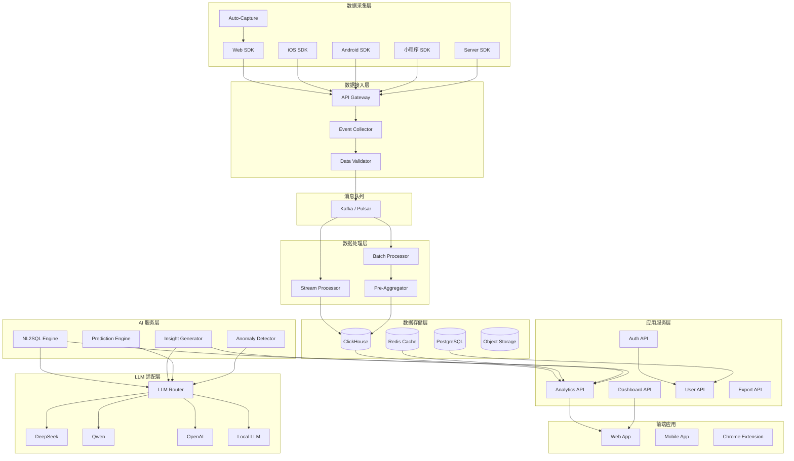
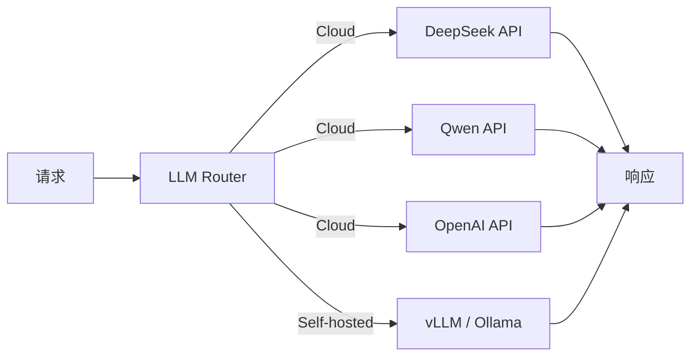
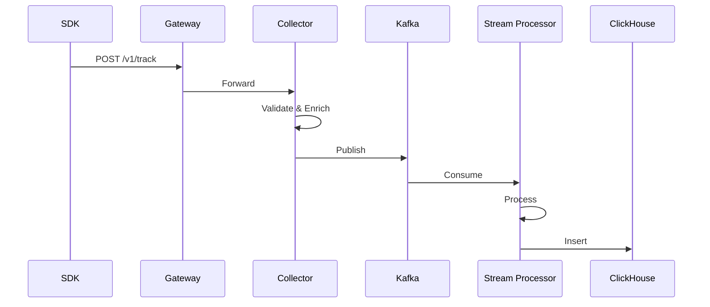
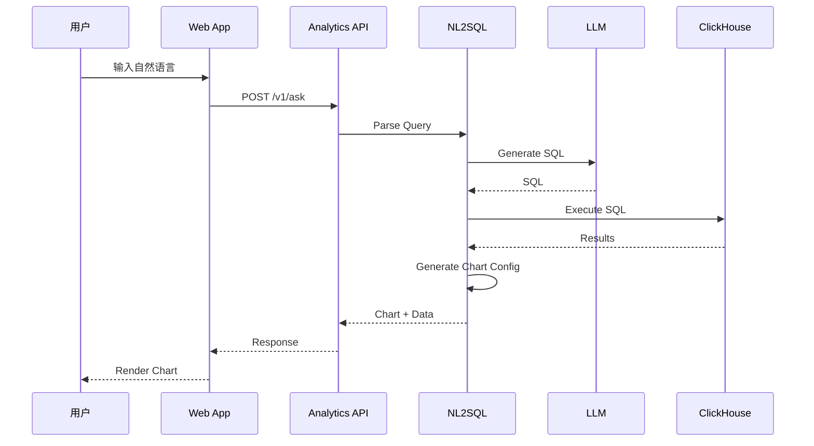
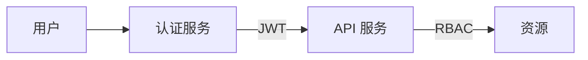
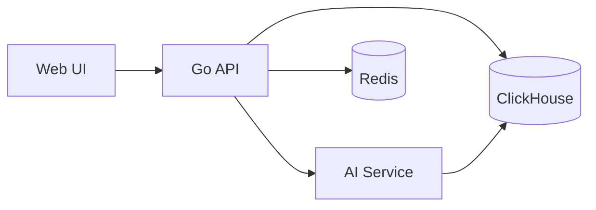
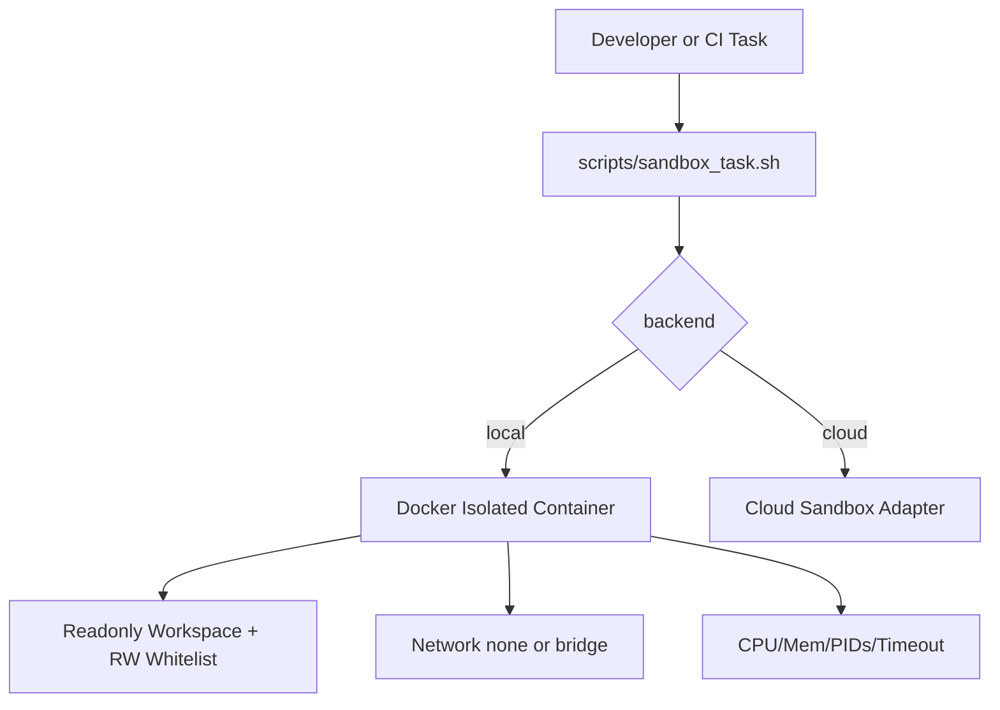
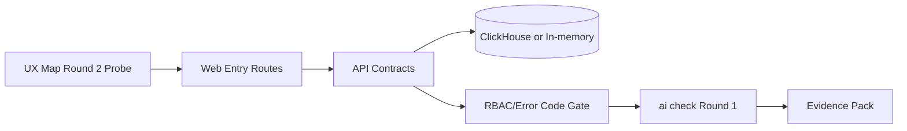

# Data Wings - 系统架构

**版本**: v1.1
**日期**: 2026-02-11
**作者**: 架构师
**PROJECT_DIR**: `/Users/mauricewen/Projects/09-data-wings`

---

## 1. 架构概述

### 1.1 系统定位

Data Wings 是一个 **AI-Native 的开源数据分析平台**，核心能力包括：

- 自然语言查询（NL2Analytics）
- 自动埋点（Auto-Capture）
- 自动洞察生成
- 预测分析
- 可视化仪表盘
- 登录与权限控制（RBAC）

### 1.2 架构原则

| 原则 | 说明 |
|------|------|
| **AI-First** | AI 能力作为一等公民，贯穿全链路 |
| **开源核心** | 核心分析引擎 MIT 开源 |
| **云原生** | 容器化、K8s 友好、弹性伸缩 |
| **国产化** | 支持国产 LLM、私有化部署 |
| **可观测** | 全链路追踪、指标监控 |

---

## 2. 系统架构图



---

## 3. 核心组件

### 3.1 数据采集层

| 组件 | 技术选型 | 职责 |
|------|----------|------|
| Web SDK | TypeScript | 浏览器端事件采集 |
| iOS SDK | Swift | iOS 应用事件采集 |
| Android SDK | Kotlin | Android 应用事件采集 |
| 小程序 SDK | JavaScript | 微信/支付宝小程序 |
| Server SDK | Python/Node/Go | 服务端事件上报 |
| Auto-Capture | DOM 监听 | 自动捕获点击/页面/表单 |

**SDK 设计要点**：
- 体积轻量：Web < 30KB gzip
- 离线缓存：断网时本地存储
- 批量上报：减少网络请求
- 数据压缩：gzip 压缩传输

### 3.2 数据接入层

| 组件 | 技术选型 | 职责 |
|------|----------|------|
| API Gateway | Kong / APISIX | 流量入口、限流、鉴权 |
| Event Collector | Go | 事件接收、格式化 |
| Data Validator | Go | 数据校验、过滤 |

**接入性能指标**：
- QPS: 100K+
- 延迟: P99 < 50ms
- 数据丢失率: < 0.01%

### 3.3 消息队列

| 组件 | 技术选型 | 职责 |
|------|----------|------|
| Message Queue | Kafka / Pulsar | 事件缓冲、解耦 |

**配置建议**：
- 分区数: 根据吞吐量调整
- 副本数: 3（保证高可用）
- 保留时间: 7 天

### 3.4 数据处理层

| 组件 | 技术选型 | 职责 |
|------|----------|------|
| Stream Processor | Flink / Kafka Streams | 实时处理 |
| Batch Processor | Spark | 离线处理 |
| Pre-Aggregator | ClickHouse MV | 预聚合 |

**处理延迟**：
- 实时流: < 5 分钟
- 离线批: T+1

### 3.5 数据存储层

| 组件 | 技术选型 | 职责 | 数据类型 |
|------|----------|------|----------|
| ClickHouse | ClickHouse | 分析查询 | 事件数据 |
| Redis | Redis Cluster | 缓存 | 热点数据 |
| PostgreSQL | PostgreSQL | 元数据 | 配置、用户 |
| Object Storage | MinIO / S3 | 文件存储 | 导出文件 |

**ClickHouse 分区策略**：
- 按日期分区（toYYYYMM）
- 按项目 ID 分区
- 数据保留：默认 1 年

### 3.6 AI 服务层

| 组件 | 职责 | 技术实现 |
|------|------|----------|
| NL2SQL Engine | 自然语言转查询 | LLM + Schema Mapping |
| Insight Generator | 自动生成洞察 | LLM + 统计分析 |
| Prediction Engine | 预测分析 | XGBoost / Prophet |
| Anomaly Detector | 异常检测 | 统计 + Isolation Forest |

### 3.7 LLM 适配层



**LLM Router 策略**：
- 优先级：私有化 > 国产云 > 国际云
- 降级：主 LLM 超时/失败时自动切换
- 缓存：相同查询缓存结果

---

## 4. 数据流

### 4.1 事件采集流



### 4.2 查询分析流



---

## 5. 部署架构

### 5.1 云服务架构

```mermaid
graph TB
    subgraph "CDN"
        CDN[Cloudflare / 阿里云 CDN]
    end

    subgraph "Load Balancer"
        LB[SLB / ALB]
    end

    subgraph "Kubernetes Cluster"
        subgraph "Ingress"
            Ingress[Nginx Ingress]
        end

        subgraph "Services"
            WebApp[Web App]
            API[API Services]
            Worker[Workers]
        end

        subgraph "Stateful"
            CH[ClickHouse]
            PG[PostgreSQL]
            Redis[Redis]
        end
    end

    subgraph "External"
        Kafka[Managed Kafka]
        S3[Object Storage]
        LLM[LLM API]
    end

    CDN --> LB
    LB --> Ingress
    Ingress --> WebApp
    Ingress --> API
    API --> CH
    API --> PG
    API --> Redis
    API --> Kafka
    API --> LLM
    Worker --> Kafka
    Worker --> CH
```

### 5.2 私有化部署架构

**Docker Compose（小规模）**：
- 适用：< 1000 万日事件
- 资源：8C16G 起

**Kubernetes（生产级）**：
- 适用：> 1000 万日事件
- 高可用、弹性伸缩

### 5.3 资源规划

| 规模 | 日事件量 | ClickHouse | API 服务 | 估算成本 |
|------|----------|------------|----------|----------|
| 小型 | < 100 万 | 2C8G x1 | 2C4G x2 | $200/月 |
| 中型 | 100-1000 万 | 8C32G x3 | 4C8G x3 | $1,000/月 |
| 大型 | > 1000 万 | 16C64G x5+ | 8C16G x5+ | $5,000+/月 |

---

## 6. 安全架构

### 6.1 网络安全

| 层级 | 措施 |
|------|------|
| 边缘 | WAF、DDoS 防护、CDN |
| 传输 | TLS 1.3 强制 |
| 服务间 | mTLS、服务网格 |
| 数据库 | VPC 隔离、白名单 |

### 6.2 数据安全

| 措施 | 实现 |
|------|------|
| 加密存储 | AES-256 |
| 字段脱敏 | PII 自动识别脱敏 |
| 访问控制 | RBAC + 行级权限 |
| 审计日志 | 全操作记录 |

### 6.3 认证授权



**支持方式**：
- 用户名/密码
- SSO（SAML/OAuth）
- API Key


### 6.4 供应链安全（Supply Chain）

- 月度审计：SOP 3.9 供应链安全持续监控（证据：`outputs/sop-supply-chain/3-9-ee500287/`）
  - Summary：`outputs/sop-supply-chain/3-9-ee500287/reports/summary.md`
  - Report：`outputs/sop-supply-chain/3-9-ee500287/reports/supply_chain_report.md`
- CI Gate：`.github/workflows/ci.yml` 新增 `Supply Chain Audit` job
  - Gate script：`scripts/supply_chain_gate.py`
  - Known-risk allowlist：`security/supply_chain_allowlist.json`
- 当前已知风险（2026-02-13，High）：
  - `glob`（GHSA-5j98-mcp5-4vw2，CLI-only，transitive）
  - `next`（GHSA-h25m-26qc-wcjf，upgrade to >=15.0.8 pending）


### 6.5 Postmortem 自动化守门（Release Gate）

- Postmortems：`postmortem/PM-*.md`（包含 machine-readable triggers：path/keyword/regex）
- CI Gate：`.github/workflows/ci.yml` 新增 `postmortem-scan` job
  - Scanner：`scripts/postmortem_scan.py`
  - Evidence：`outputs/sop-postmortem/5-3-f13a8584/`
- Policy：命中 `status != fixed` 的 PM triggers 直接阻塞 merge/release；命中 fixed PM 仅告警（用于提醒高风险改动区域）。


---

## 7. 可观测性

### 7.1 监控指标

| 类型 | 指标 | 告警阈值 |
|------|------|----------|
| 系统 | CPU/内存/磁盘 | > 80% |
| 应用 | 请求延迟 P99 | > 1s |
| 应用 | 错误率 | > 1% |
| 业务 | 事件写入 QPS | 异常波动 |
| 业务 | 查询成功率 | < 99% |

### 7.2 日志架构

```
应用日志 --> Fluent Bit --> Kafka --> Elasticsearch --> Kibana
```

### 7.3 链路追踪

```
OpenTelemetry SDK --> Collector --> Jaeger / Tempo
```

---

## 8. 技术栈汇总

| 层级 | 技术选型 |
|------|----------|
| **前端** | React, TypeScript, TailwindCSS, ECharts |
| **后端** | Go (API), Python (AI), Node.js (SDK) |
| **数据库** | ClickHouse, PostgreSQL, Redis |
| **消息队列** | Kafka / Pulsar |
| **AI/ML** | LangChain, XGBoost, Prophet |
| **LLM** | DeepSeek, Qwen, OpenAI (可选) |
| **容器** | Docker, Kubernetes |
| **监控** | Prometheus, Grafana, Jaeger |
| **CI/CD** | GitHub Actions, ArgoCD |

---

## 9. 质量门禁与真实流程测试

**目标**: 以真实流程验证关键链路稳定性，并形成可审计证据闭环。

**执行入口**:
- SOP: `doc/00_project/initiative_data-wings/REAL_FLOW_TEST_SOP.md`
- 证据: `doc/00_project/initiative_data-wings/REAL_FLOW_TEST_EVIDENCE.md`

**覆盖范围**:
- Web → API → AI → ClickHouse 端到端链路
- 关键路径 + 异常路径（权限/数据/服务不可用）

**验收门禁**:
- Round 1: `ai check` 自动化验证通过
- Round 2: UX Map 人工模拟测试完成并留证据
- UI/UX: network / console / performance / visual regression 证据齐全

---

## 10. 演进路线

### Phase 1: MVP（Month 1-2）
- Web SDK + Auto-Capture
- 基础事件分析
- NL2SQL 基础版

### Phase 2: V1.0（Month 3-4）
- 全端 SDK
- 完整分析能力
- 自动洞察

### Phase 3: V2.0（Month 5-8）
- 预测分析
- A/B 测试
- 企业级功能

---

## 11. 前后端入口与契约一致性（2026-02-11）

### 11.1 前端路由入口（Next.js App Router）

| URL | 文件入口 |
|-----|----------|
| `/` | `apps/web/src/app/page.tsx` |
| `/login` | `apps/web/src/app/login/page.tsx` |
| `/signup` | `apps/web/src/app/signup/page.tsx` |
| `/app` | `apps/web/src/app/app/page.tsx` |
| `/app/ask` | `apps/web/src/app/app/ask/page.tsx` |
| `/app/dashboards` | `apps/web/src/app/app/dashboards/page.tsx` |
| `/app/settings/team` | `apps/web/src/app/app/settings/team/page.tsx` |
| `/api/health` | `apps/web/src/app/api/health/route.ts` |

### 11.2 后端 API 入口（Go / Gin）

| API | 方法 | 入口函数 |
|-----|------|----------|
| `/health` | GET | `cmd/server/main.go` inline handler |
| `/api/v1/auth/signup` | POST | `AuthHandler.Signup` |
| `/api/v1/auth/login` | POST | `AuthHandler.Login` |
| `/api/v1/auth/me` | GET | `AuthHandler.Me` |
| `/api/v1/track` | POST | `EventHandler.Track` / degraded handler |
| `/api/v1/identify` | POST | `EventHandler.Identify` / degraded handler |
| `/api/v1/batch` | POST | `EventHandler.Batch` / degraded handler |
| `/api/v1/query` | POST | `AnalyticsHandler.Query` / degraded handler |
| `/api/v1/ask` | POST | `AnalyticsHandler.Ask` / degraded handler |
| `/api/v1/overview` | GET | `AnalyticsHandler.GetOverview` / degraded handler |
| `/api/v1/dashboards` | GET/POST | `DashboardHandler.List/Create` |
| `/api/v1/dashboards/:id` | GET/PUT/DELETE | `DashboardHandler.Get/Update/Delete` |
| `/api/v1/team` | GET/POST | `TeamHandler.List/Create` |
| `/api/v1/team/:id` | DELETE | `TeamHandler.Delete` |

### 11.3 运行入口矩阵（Local vs Docker Compose）

| 服务 | Local Dev | Docker Compose（Host） | 入口命令/配置 |
|------|-----------|------------------------|---------------|
| Web | `:3000` | `:3009` | `pnpm dev --filter @data-wings/web` / `docker-compose.yml` |
| API | `:8080` | `:4009` | `go run ./cmd/server` / `docker-compose.yml` |
| AI | `:8001` | `:8009` | `uvicorn src.main:app --port 8001` / `docker-compose.yml` |
| ClickHouse | `:8123/:9000` | `:8123/:9000` | `docker compose up -d clickhouse` |
| Redis | `:6379` | `:6309` | `docker compose up -d redis` |

### 11.3.1 CORS 白名单基线（防回归）

- API `CORS_ORIGINS` 基线：`http://localhost:3000,http://localhost:3009,http://localhost:3100`
- AI `DW_CORS_ORIGINS` 基线：`["http://localhost:3000","http://localhost:3009","http://localhost:3100"]`
- 验证准则：
  - `Origin: http://localhost:3000` 对 `/api/v1/auth/signup` 预检必须返回 `204`
  - `Origin: http://localhost:3009` 对 `/api/v1/auth/signup` 预检必须返回 `204`

### 11.3.2 Web 健康检查基线（防回归）

- Docker HEALTHCHECK 统一使用 IPv4 loopback：
  - `http://127.0.0.1:3000/api/health`
- 禁止使用 `localhost` 作为容器内健康检查地址（避免解析到 `::1` 导致假性 unhealthy）。

### 11.3.3 Compose 配置基线（防噪音）

- 采用 Compose v2 规范：`docker-compose.yml` 不再声明顶层 `version` 字段。
- 验证命令：`docker compose ps` / `docker compose config` 不应出现 `attribute 'version' is obsolete` 告警。

### 11.3.4 CLI Entrypoint 基线（防回归）

- `make dev` 必须启动全栈（web+api+ai）；当本机未安装 Go 时自动回退到 `docker compose up web api ai clickhouse redis`。
- `make dev-smoke` 用于非交互健康门禁：
  - Docker fallback: `http://localhost:4009/health` + `http://localhost:8009/health`
  - Local mode: `http://localhost:8080/health` + `http://localhost:8001/health`
- 实现入口：
  - `scripts/dev_all.sh`
  - `Makefile` targets: `dev`, `dev-smoke`
- 验证证据（all-green queue）：`outputs/sop-entrypoint-consistency/3-2-4ebf9336/logs/queue.log`

### 11.4 API 返回结构（统一契约）

**成功响应（Canonical）**:

```json
{
  "status": "ok",
  "...": "payload"
}
```

**错误响应（Canonical）**:

```json
{
  "status": "error",
  "message": "human readable message",
  "error_code": "STABLE_MACHINE_CODE",
  "...": "optional details"
}
```

**关键对齐项**:
- `/api/v1/ask` 已统一为 `{"status":"ok","data":{...}}`，与其它业务 API 一致。
- 所有 API 错误返回统一包含 `error_code`（如 `AUTH_INVALID_CREDENTIALS`、`ANALYTICS_QUERY_FAILED`）。
- 前端 `apps/web/src/lib/api.ts` 已对齐解析 `message/detail/error_code/details`。

---

## 12. 架构圆桌 ADR 与风险模型（2026-02-11）

### 12.1 系统边界与分层（Architect）

本轮采用三层边界模型，并将 Go API 固化为产品域唯一业务入口：

| 层级 | 职责 | 代表组件 |
|------|------|----------|
| L1 Edge/UI | 页面交互、会话态、错误展示 | `apps/web` |
| L2 Control/API | 认证授权、RBAC、契约统一、降级策略 | `services/api` |
| L3 Execution/Data | NL2SQL/查询执行/存储 | `services/ai`, ClickHouse, Redis |



**边界约束**:
- 前端禁止直连 AI 服务（只允许通过 API）。
- API 返回结构保持 canonical envelope（`status` + `error_code`）。
- 依赖故障由 API 层统一转译和降级，不向前端泄漏内部实现细节。

### 12.2 威胁模型摘要（Security）

| 风险点 | 现状 | 优先动作 |
|--------|------|----------|
| 默认 JWT 密钥 | `config.Load()` 允许默认值 | 非开发环境启动强校验（P0） |
| NL2SQL 执行边界 | AI 生成 SQL 后由 API 执行 | 只读执行 + SQL 白名单校验（P0） |
| API -> AI 信任链 | 当前无服务间鉴权 | 引入 internal token 或 mTLS（P1） |
| 入口/CORS 漂移 | 环境变量与 compose 不一致曾导致 `Failed to fetch` | 将入口矩阵纳入 CI 校验（P1） |

详见：`doc/00_project/initiative_data-wings/ARCHITECTURE_RISK_REGISTER.md`

### 12.3 可靠性与容量建议（SRE）

| 维度 | 当前观察 | 建议 |
|------|----------|------|
| Timeout Budget | API server write timeout 15s，API->AI client timeout 30s | 统一预算，避免上游提前断连 |
| 故障隔离 | DB 不可用已有 degraded handler | 增加 AI circuit-breaker + retry budget |
| 可观测性 | 缺少统一 request_id/trace_id | 接入 OpenTelemetry 并贯穿 Web/API/AI |
| 容量基线 | 尚无公开压测阈值 | 建立 QPS/并发/P95-P99 基线与扩容规则 |

建议 SLO（首版）:
- API 可用性 >= 99.5%
- `/api/v1/ask` P95 < 2.5s（缓存命中场景）
- 5xx 错误率 < 1%

### 12.4 决策与证据链接

- ADR: `doc/00_project/initiative_data-wings/ADR-2026-02-11-architecture-council.md`
- 风险清单: `doc/00_project/initiative_data-wings/ARCHITECTURE_RISK_REGISTER.md`
- 圆桌报告: `outputs/sop-architecture-council/20260211-225928/reports/architecture_council_report.md`

---

## 13. 全局沙盒化执行架构（2026-02-11）

### 13.1 目标与边界

对关键任务引入统一沙盒执行边界，默认最小权限：

- 默认禁网（仅集成冒烟场景放开）
- 项目根目录只读挂载，仅白名单路径可写
- 统一 CPU/内存/PIDs/超时配额
- 支持本地隔离与云沙盒适配两种后端

### 13.2 执行路径



### 13.3 关键任务策略（摘要）

| Task | Network | RW 白名单 | 配额 |
|------|---------|------------|------|
| `docs-audit` | `none` | `.sandbox-tmp`, `outputs`, `doc` | `1 CPU / 1g / 128 pids / 300s` |
| `web-lint` | `none` | `.sandbox-tmp`, `outputs`, `apps/web` | `2 CPU / 2g / 256 pids / 900s` |
| `go-unit` | `none` | `.sandbox-tmp`, `outputs`, `services/api` | `2 CPU / 2g / 256 pids / 900s` |
| `ai-unit` | `none` | `.sandbox-tmp`, `outputs`, `services/ai` | `2 CPU / 2g / 256 pids / 900s` |
| `integration-smoke` | `bridge` | `.sandbox-tmp`, `outputs`, `doc`, `apps/web`, `services/api`, `services/ai` | `4 CPU / 4g / 512 pids / 1200s` |

完整策略见：`doc/00_project/initiative_data-wings/SANDBOX_ISOLATION_POLICY.md`

### 13.4 安全说明（Security Notes）

- 本地沙盒统一启用 `cap_drop=ALL` 与 `no_new_privileges`。
- 通过 `--read-only` + RW 白名单降低误写与供应链脚本篡改风险。
- 云沙盒模式必须显式注入 `DW_CLOUD_SANDBOX_CMD`，避免隐式回退到非隔离执行。
- 沙盒策略与运行证据需保存到 `outputs/<sop-id>/<run-id>/` 便于审计。

---

## 14. 真实 API 与可复现实验（2026-02-11）

### 14.1 核心路径验证机制

核心路径通过真实 API 回放脚本执行：

- Fixture: `fixtures/replay/real_api/core_path.fixture.json`
- Runner: `scripts/replay_real_api_fixture.py`
- Baseline Capture: `fixtures/replay/real_api/core_path.capture.baseline.json`

该机制在非生产环境执行 `signup/login/me/track/overview/ask/dashboards`，
并输出完整请求/响应用于回归对比。

### 14.2 回归可复现原则

- 使用固定 fixture 模板 + 真实响应捕获（capture）形成可复现实验基线。
- `track/overview` 作为核心持久化链路，fixture 期望状态固定为 `200`（不再接受 `503`）。
- `ask` 允许在外部 LLM 不可用时返回可追踪错误（含 `error_code`），但最终验收以真实 API 成功路径为准。
- 回放报告必须记录每个步骤的状态码和是否命中预期。

### 14.3 验收声明（强制）

最终验收必须通过真实 API。  
不得使用 mock 响应替代核心路径验收。

---

## 15. 功能闭环完整实现检查（SOP 3.7, 2026-02-11）

### 15.1 本轮问题与根因

- 现象：`/api/v1/track`、`/api/v1/overview`、`/api/v1/ask` 在容器冷启动后长期返回 `503`。
- 根因：API 启动时仅尝试一次 ClickHouse 连接，首次失败后进入永久 degraded 分支，且无重连。

### 15.2 架构修复

- 在 `services/api/cmd/server/main.go` 引入 ClickHouse 启动重试初始化：
  - `initClickHouseRepository(cfg)` 按最大尝试次数和重试间隔循环连接。
  - 超过上限后才进入 degraded 模式。
- 新增配置入口（`services/api/internal/config/config.go` / `docker-compose.yml`）：
  - `CLICKHOUSE_CONNECT_MAX_ATTEMPTS`
  - `CLICKHOUSE_CONNECT_RETRY_DELAY_SECOND`

### 15.3 契约与权限闭环

- 新增契约测试：`services/api/internal/handlers/contract_test.go`
  - `AUTH_INVALID_ROLE`（signup 非法角色）
  - `AUTH_HEADER_MISSING`（缺失授权头）
  - `AUTH_FORBIDDEN`（RBAC 拒绝）
  - 成功响应结构（`status=ok` + `token` + `user`）
- 前端继续通过 `apps/web/src/lib/api.ts` 统一解析 `error_code` 与错误消息。

### 15.4 验证证据

- 入口闭环报告：`outputs/sop-full-loop-check/3-7-f1b07249/reports/entrypoint_closure_report.md`
- 系统闭环报告：`outputs/sop-full-loop-check/3-7-f1b07249/reports/system_loop_verification.md`
- 契约闭环报告：`outputs/sop-full-loop-check/3-7-f1b07249/reports/api_contract_closure_report.md`
- 真实 API 回放：`outputs/sop-full-loop-check/3-7-f1b07249/reports/real_api_capture_after_fix.md`
- UI/E2E 回归：`outputs/sop-full-loop-check/3-7-f1b07249/reports/round2_ui_flow_report.md`
- 自动化检查：`outputs/sop-full-loop-check/3-7-f1b07249/logs/ai-check.log`

---

## 16. SOTA SOP 对标后的架构增强（SOP 1.10, 2026-02-11）

基于近 12 个月全球 SOTA 平台调研，新增“流程治理层”架构约束：

| 能力域 | 架构要求 | 当前落点 |
|------|------|------|
| 流程编排 | 任务必须具备状态机（plan/execute/verify/evidence/closeout） | `ai sop` + `task_plan.md` |
| 质量门禁 | contract/e2e/ai check 必须可追踪 | `outputs/<sop-id>/<run-id>/logs` |
| 证据归档 | logs/reports/diff/screenshot 统一目录结构 | `outputs/` |
| 角色治理 | complex 任务启用多角色编排（Swarm/Council/Watchdog） | agent-teams blueprints |
| 风险闭环 | 失败模式沉淀到 rolling ledger 与优化计划 | `ROLLING_REQUIREMENTS_AND_PROMPTS.md` / `PLATFORM_OPTIMIZATION_PLAN.md` |

该增强不改变业务数据链路（UI -> API -> AI/Data），但强化了工程交付链路的可治理性与可审计性。

---

## 17. 一键全量交付验证闭环（SOP 1.1, 2026-02-12）

### 17.1 验证拓扑



### 17.2 FE/BE Gate 对齐结果

| Gate | 验证点 | 结果 | 证据 |
|------|------|------|------|
| FE Network | `signup` 请求命中 API 入口 | PASS | `reports/round2_uxmap_probe.json` |
| FE Console | console/page 错误计数 | PASS（0/0） | `reports/round2_uxmap_probe.json` |
| FE Performance | DOMContentLoaded 预算（<3000ms） | PASS | `reports/round2_uxmap_probe.json` |
| FE Visual | 核心路径截图 | PASS | `screenshots/round2-*.png` |
| BE Contract | `AUTH_INVALID_ROLE` / `AUTH_HEADER_MISSING` / `AUTH_FORBIDDEN` | PASS | `reports/backend_contract_probe.json` |
| BE Entry | `/health` + CORS preflight（3000/3009） | PASS | `reports/backend_contract_probe.json` |
| BE Real API | core fixture 7/7 | PASS | `reports/real_api_capture.md` |
| Round 1 | `ai check` | PASS | `logs/ai-check-round1.log` |

说明：以上证据路径均位于 `outputs/sop-one-click-full-delivery/1-1-2ddd14fb/`。

### 17.3 架构守门结论

- 前端入口、后端入口、CORS 基线与错误码契约在本轮验证中保持一致。
- 验证链路满足“真实 API + 可复现 fixture + machine-readable 报告”三要素。
- 该基线可作为后续发布前回归守门模板复用。

---

## 18. 项目级全链路回归守门（SOP 4.1, 2026-02-12）

### 18.1 回归链路

`Homepage -> Signup -> App core routes -> API replay -> Contract probe -> ai check`

### 18.2 本轮结果（run: 4-1-6117de0a）

| Gate | 结果 | 证据 |
|------|------|------|
| Homepage + UX Map 路径 | PASS | `reports/uxmap_e2e_probe.json` |
| API 核心链路回放 | PASS (7/7) | `reports/real_api_capture.md` |
| 契约与错误码 | PASS (6/6) | `reports/backend_contract_probe.md` |
| 全局门禁 | PASS | `logs/ai-check.log` |

### 18.3 守门结论

项目级全链路回归通过，可作为当前基线版本的发布前复验模板。

---

## 19. 联合验收与发布守门链路（SOP 5.1, 2026-02-12）

### 19.1 守门链路

`Product Acceptance -> Engineering Gate (ai check + API/contract) -> Quality Evidence Review -> Release Ready`

### 19.2 本轮结果（run: 5-1-3095c8c4）

| Gate | 结果 | 证据 |
|------|------|------|
| Product（UX Map 路径） | PASS | `reports/uxmap_e2e_probe.md` |
| Engineering（Round 1） | PASS | `logs/ai-check-round1.log` |
| Engineering（API/Contract） | PASS | `reports/real_api_capture.md`, `reports/backend_contract_probe.md` |
| Quality（证据完整性） | PASS | `reports/joint_acceptance_release_gate.md` |

说明：以上路径均位于 `outputs/sop-joint-acceptance/5-1-3095c8c4/`。

### 19.3 架构结论

5.1 将“项目级回归守门”进一步提升为“发布前联合验收守门”，形成可复用的 Pipeline gate 模板。

---

## 20. 一键全量交付重跑守门（SOP 1.1 rerun, 2026-02-12）

### 20.1 重跑链路

`Plan-first -> UX Map Round 2 -> FE Full Probe -> Real API Replay -> Contract Probe -> Closeout`

### 20.2 本轮结果（run: 1-1-719289f3）

| Gate | 结果 | 证据 |
|------|------|------|
| Round 1 `ai check` | PASS | `logs/ai-check-round1.log` |
| UX Map Round 2 | PASS | `reports/uxmap_e2e_probe.json` |
| FE Full Probe | PASS | `reports/frontend_full_probe.json` |
| Real API Replay | PASS | `reports/real_api_capture.json` |
| Contract Probe | PASS（6/6） | `reports/backend_contract_probe.json` |
| Three-end Snapshot | PASS（Local=GitHub, Prod=N/A） | `logs/git-local-remote-head.log` |

说明：以上证据路径均位于 `outputs/sop-one-click-full-delivery/1-1-719289f3/`。

### 20.3 架构结论

当前基线已具备可重复执行的一键全量交付能力，无新增架构阻断项。

---

## 21. 多角色头脑风暴架构约束（SOP 1.3, 2026-02-12）

### 21.1 Council 输出

- 本轮不扩系统边界，不新增权限模型复杂度。
- 优先优化激活链路与默认模板入口，保持验证链路稳定。
- 实施阶段继续沿用三门禁：`ai check` + UX Map 回归 + 契约探针。

### 21.2 风险与守门

| 风险 | 影响 | 守门策略 |
|------|------|------|
| 为追求功能扩展引入跨层改动 | 回归概率上升 | 先做激活链路优化，延后复杂功能 |
| SEO 导流与产品入口不一致 | 转化损失 | 保持 sitemap 与 UX 主链路一致 |
| 多角色结论冲突 | 执行口径漂移 | 以 ADR 作为唯一决策记录 |

### 21.3 决策记录

- ADR: `doc/00_project/initiative_data-wings/ADR-2026-02-12-multi-role-brainstorm.md`
- 报告: `outputs/sop-multi-role-brainstorm/1-3-670e1dcd/reports/multi_role_brainstorm_report.md`

---

## 22. 架构圆桌增量决策（SOP 1.4, 2026-02-12）

### 22.1 角色输出摘要

- Architect: 保持 `Web -> API -> AI/Data` 边界不变，避免跨层依赖。
- Security: 新增 auth 限流、API->AI 内部鉴权、证据保留策略三项优先风险。
- SRE: 保持三门禁为发布硬约束，补齐 trace_id 贯通与容量阈值告警。

### 22.2 决策与影响

| 决策 | 影响 |
|------|------|
| AC-1 边界不变 | 保持低回归风险，实施成本可控 |
| AC-2 安全增量优先 | 降低 auth 与内部调用滥用风险 |
| AC-3 三门禁不降级 | 保障交付质量可审计 |

### 22.3 证据与 ADR

- 报告：`outputs/sop-architecture-council/1-4-cdf0f11e/reports/architecture_council_report.md`
- ADR：`doc/00_project/initiative_data-wings/ADR-2026-02-12-architecture-council-refresh.md`
- 风险清单：`doc/00_project/initiative_data-wings/ARCHITECTURE_RISK_REGISTER.md`

---

猪哥云（四川）网络科技有限公司 | 合规网 www.hegui.com
猪哥云-数据产品部-Maurice | maurice_wen@proton.me
2025 猪哥云-灵阙企业级智能体平台
