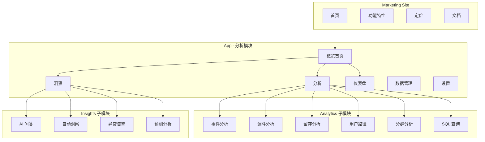
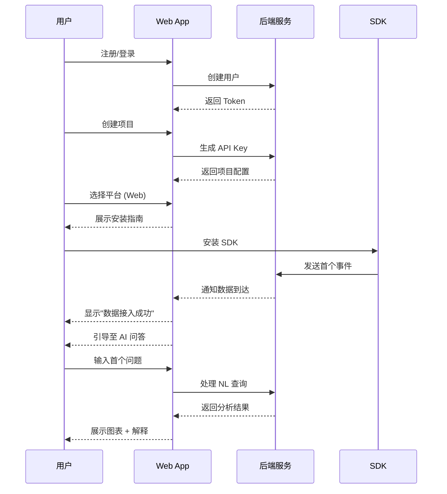
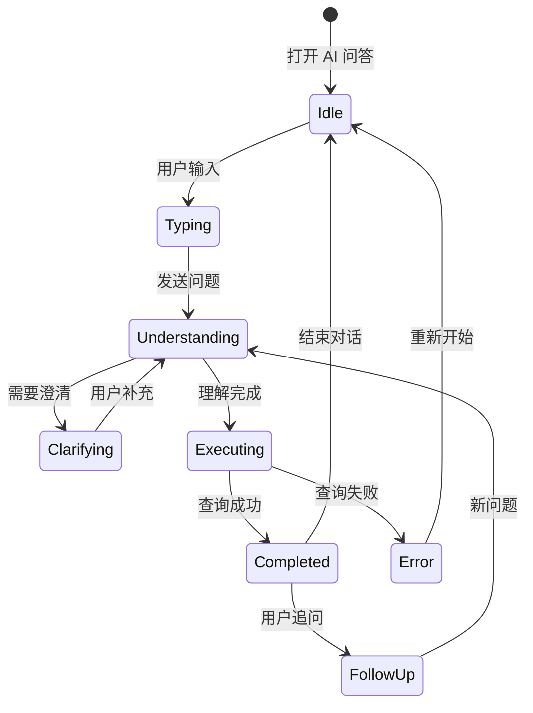
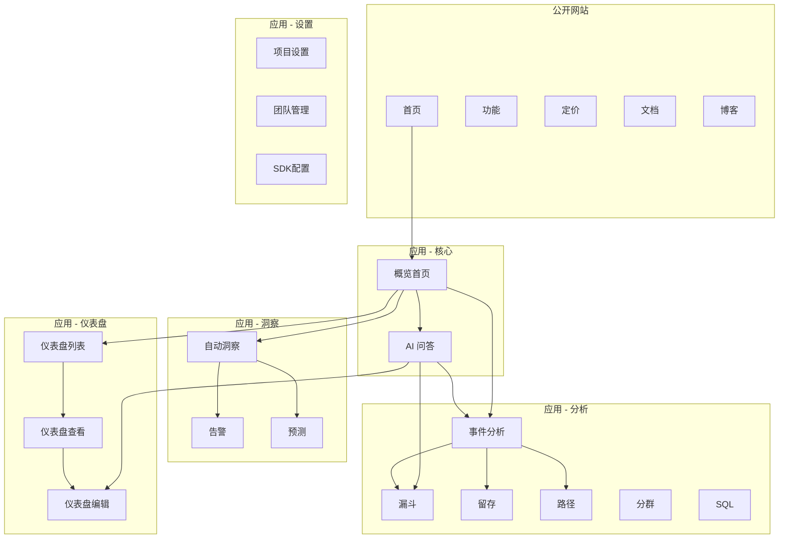
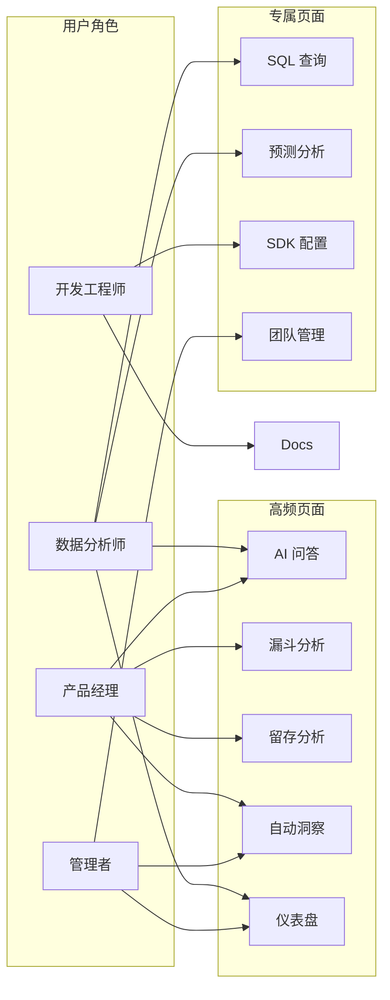
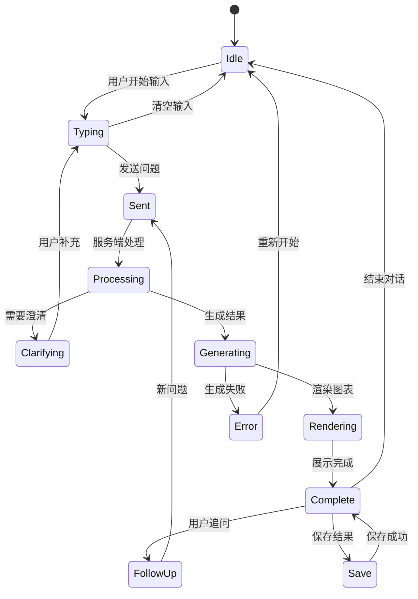
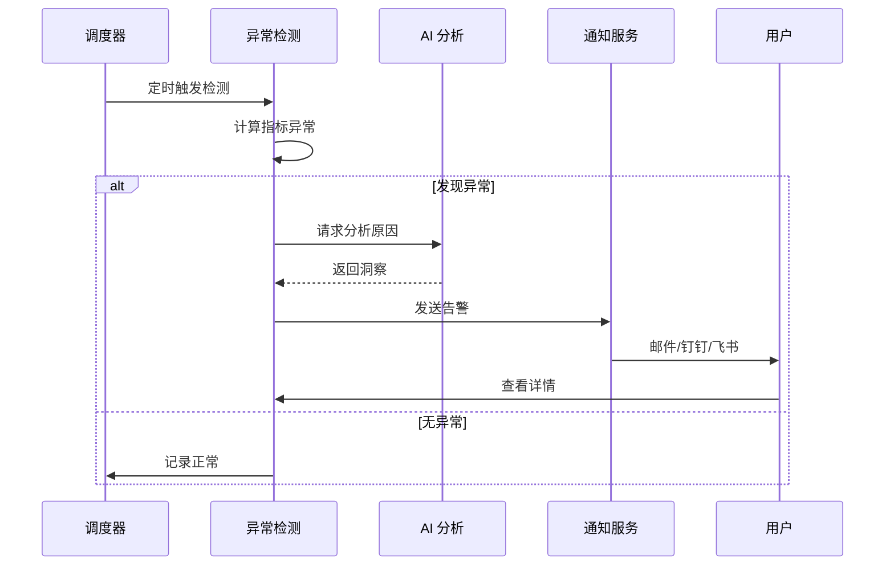

# Data Wings - 用户体验地图

**版本**: v1.6
**日期**: 2026-02-12
**作者**: UX 设计师
**PROJECT_DIR**: `/Users/mauricewen/Projects/09-data-wings`

---

## 1. 用户角色（Personas）

### 1.1 数据分析师 - Alex

| 属性 | 描述 |
|------|------|
| **角色描述** | 负责业务数据分析，具备 SQL 能力，日常产出分析报告 |
| **核心诉求** | 快速获取业务指标，自主完成分析，减少对数据工程师的依赖 |
| **痛点** | 取数排期长、SQL 编写繁琐、重复性报表工作多 |
| **期望** | 用自然语言提问即可获得分析结果，自动生成周报 |
| **关键场景** | 日常指标监控、临时分析需求、定期报告输出 |

### 1.2 产品经理 - Bella

| 属性 | 描述 |
|------|------|
| **角色描述** | 负责产品功能规划，关注用户行为和功能效果 |
| **核心诉求** | 实时了解功能效果，验证产品假设，数据驱动决策 |
| **痛点** | 埋点复杂需等开发、不懂 SQL、分析结果难以解读 |
| **期望** | 5 分钟接入，零代码看数据，AI 自动给建议 |
| **关键场景** | 功能上线效果分析、用户路径优化、A/B 测试 |

### 1.3 开发工程师 - Chris

| 属性 | 描述 |
|------|------|
| **角色描述** | 负责产品开发，需要集成 SDK 和实现埋点 |
| **核心诉求** | 快速完成集成，低维护成本，API 文档清晰 |
| **痛点** | SDK 体积大影响性能、埋点方案频繁变更、调试困难 |
| **期望** | SDK 轻量、Auto-Capture 减少工作量、实时调试工具 |
| **关键场景** | SDK 集成、埋点开发、数据校验、性能优化 |

### 1.4 企业管理者 - Diana

| 属性 | 描述 |
|------|------|
| **角色描述** | 技术/业务负责人，关注整体业务表现和技术选型 |
| **核心诉求** | 数据安全、成本可控、自主可控、合规达标 |
| **痛点** | 国外产品合规风险、私有化成本高、厂商锁定 |
| **期望** | 私有化部署、国产化、开源可审计、合规模板 |
| **关键场景** | 技术选型、数据安全审计、合规报告 |

---

## 2. 用户旅程（User Journey）

### 2.1 数据分析师旅程

```
阶段        认知           试用           使用           深度使用        推荐
           |              |              |              |              |
触点      搜索/推荐       注册/接入       日常分析        高级功能        分享/口碑
           |              |              |              |              |
行为      了解AI分析      5分钟接入      自然语言查询    预测分析        推荐同事
          对比竞品        首次看数据     创建仪表盘      自动洞察        社区贡献
           |              |              |              |              |
情绪       中             高             高             高              高
          "这个有意思"   "接入真快"    "省时间"       "太智能了"     "必须推荐"
           |              |              |              |              |
机会      突出AI差异      优化Onboard    查询建议       个性化洞察      激励机制
          案例展示        新手引导       模板库         学习偏好        社区运营
```

### 2.2 产品经理旅程

```
阶段        认知           试用           使用           深度使用        推荐
           |              |              |              |              |
触点      同行推荐        Demo/试用      看数据         洞察驱动决策    团队推广
           |              |              |              |              |
行为      了解功能        零代码接入     漏斗留存分析   AB测试分析      邀请同事
          关注易用性      首次提问       周报订阅       预测分析        写使用心得
           |              |              |              |              |
情绪       中             高             中-高          高              高
          "能不用SQL吗"  "终于能自己看" "数据有了"    "决策有依据"   "团队都用"
           |              |              |              |              |
机会      强调零代码      引导式提问     报告模板       决策建议        协作功能
          案例视频        示例问题       定时推送       场景化洞察      权限管理
```

---

## 3. 信息架构（Information Architecture）

### 3.1 一级导航

```
┌─────────────────────────────────────────────────────────────────┐
│  Logo   首页   分析   洞察   仪表盘   数据   设置      用户头像  │
└─────────────────────────────────────────────────────────────────┘
```

### 3.2 完整导航结构

```
Data Wings
├── 首页 (Dashboard)
│   ├── 概览卡片
│   ├── 快捷入口
│   └── 最近访问
│
├── 分析 (Analytics)
│   ├── 事件分析
│   │   ├── 事件趋势
│   │   └── 事件明细
│   ├── 漏斗分析
│   ├── 留存分析
│   ├── 用户路径
│   ├── 分群分析
│   └── SQL 查询
│
├── 洞察 (Insights)
│   ├── AI 问答
│   ├── 自动洞察
│   ├── 异常告警
│   └── 预测分析
│
├── 仪表盘 (Dashboards)
│   ├── 我的仪表盘
│   ├── 团队仪表盘
│   └── 模板库
│
├── 数据 (Data)
│   ├── 事件管理
│   ├── 用户属性
│   ├── 数据导入
│   └── 数据导出
│
└── 设置 (Settings)
    ├── 项目设置
    ├── 团队管理
    ├── 集成配置
    ├── SDK 接入
    └── 账户设置
```

### 3.3 Mermaid 架构图



---

## 4. 核心页面流程

### 4.1 Onboarding 流程

```
注册 --> 创建项目 --> 选择平台 --> 安装SDK --> 验证数据 --> 首次分析
 |         |            |           |           |           |
邮箱注册   项目名称     Web/iOS    复制代码    实时校验    引导提问
手机注册   项目描述     Android    npm安装     成功提示    示例问题
SSO       行业选择     小程序                  错误排查    模板报告
```

**Onboarding 时序图**:



### 4.2 日常分析流程

```
提出问题 --> AI理解 --> 生成查询 --> 展示结果 --> 追问/调整 --> 保存/分享
    |          |          |           |           |            |
自然语言    意图识别    SQL生成    图表渲染    多轮对话      仪表盘
预设模板    参数确认    执行查询    数据解读    修改条件      导出报告
```

### 4.3 AI 交互流程



---

## 5. 关键交互设计原则

### 5.1 AI 交互设计原则

| 原则 | 说明 | 示例 |
|------|------|------|
| **渐进披露** | 先给结论，再给详情 | "日活下降 15%"，点击展开"主要原因是..." |
| **可解释性** | 说明 AI 如何得出结论 | "我理解您在问过去 7 天的 DAU 趋势" |
| **容错性** | 提供修正机会 | "不对？点击这里调整时间范围" |
| **引导性** | 推荐下一步问题 | "您可能还想知道：留存率变化？" |
| **确定性** | 明确正在处理 | 加载动画 + "正在分析 1.2M 条数据..." |

### 5.2 数据可视化原则

| 原则 | 说明 |
|------|------|
| **图表自适应** | 根据数据特征自动选择最佳图表类型 |
| **色彩一致** | 同一指标在不同视图使用相同颜色 |
| **交互提示** | hover 显示详细数值，click 下钻 |
| **响应式** | 移动端自动调整图表布局 |

### 5.3 空状态处理

| 场景 | 处理方式 |
|------|----------|
| 无数据 | 引导接入 SDK，提供测试数据 |
| 无结果 | 建议调整条件，推荐相似查询 |
| 首次使用 | 交互式教程，示例问题 |
| 加载中 | 骨架屏 + 进度提示 |

### 5.4 错误处理

| 错误类型 | 处理方式 |
|----------|----------|
| 查询超时 | "数据量较大，已转为后台处理，完成后通知您" |
| 语义不明 | "我不太确定您的意思，您是想问...还是...？" |
| 权限不足 | "您没有访问该数据的权限，请联系管理员" |
| 系统错误 | "抱歉出了点问题，我们已记录，请稍后重试" |

---

## 6. 页面清单（Page Inventory）

### 6.1 公开页面

| 页面ID | 页面名称 | URL | 功能描述 | 用户角色 |
|--------|---------|-----|----------|----------|
| P-001 | 首页 | / | 产品介绍、核心价值 | 所有访客 |
| P-002 | 功能特性 | /features | 功能详细介绍 | 潜在用户 |
| P-003 | 定价 | /pricing | 版本对比、价格 | 决策者 |
| P-004 | 文档首页 | /docs | 文档导航 | 开发者 |
| P-005 | 快速开始 | /docs/quickstart | 5分钟入门 | 开发者 |
| P-006 | SDK 文档 | /docs/sdk/* | 各平台 SDK | 开发者 |
| P-007 | API 参考 | /docs/api | API 文档 | 开发者 |
| P-008 | 博客 | /blog | 内容营销 | 所有访客 |
| P-009 | 客户案例 | /customers | 成功案例 | 决策者 |
| P-010 | 关于我们 | /about | 公司介绍 | 所有访客 |

### 6.2 应用页面

| 页面ID | 页面名称 | URL | 功能描述 | 用户角色 |
|--------|---------|-----|----------|----------|
| A-001 | 登录 | /login | 用户登录 | 所有用户 |
| A-002 | 注册 | /signup | 用户注册 | 新用户 |
| A-003 | 概览首页 | /app | 数据概览、快捷入口 | 所有用户 |
| A-004 | AI 问答 | /app/ask | 自然语言查询 | 分析师、PM |
| A-005 | 事件分析 | /app/events | 事件趋势分析 | 分析师 |
| A-006 | 漏斗分析 | /app/funnels | 转化漏斗 | 分析师、PM |
| A-007 | 留存分析 | /app/retention | N日留存 | 分析师、PM |
| A-008 | 用户路径 | /app/paths | 行为路径 | 分析师、PM |
| A-009 | 分群分析 | /app/cohorts | 用户分群 | 分析师 |
| A-010 | SQL 查询 | /app/sql | 高级查询 | 分析师 |
| A-011 | 自动洞察 | /app/insights | AI 生成洞察 | 所有用户 |
| A-012 | 异常告警 | /app/alerts | 告警配置与历史 | 分析师、PM |
| A-013 | 预测分析 | /app/predictions | 流失/LTV 预测 | 分析师 |
| A-014 | 仪表盘列表 | /app/dashboards | 仪表盘管理 | 所有用户 |
| A-015 | 仪表盘详情 | /app/dashboards/:id | 查看仪表盘 | 所有用户 |
| A-016 | 仪表盘编辑 | /app/dashboards/:id/edit | 编辑仪表盘 | 分析师 |
| A-017 | 事件管理 | /app/data/events | 事件定义管理 | 开发者 |
| A-018 | 用户属性 | /app/data/properties | 用户属性管理 | 开发者 |
| A-019 | 数据导入 | /app/data/import | 历史数据导入 | 开发者 |
| A-020 | 项目设置 | /app/settings/project | 项目配置 | 管理者 |
| A-021 | 团队管理 | /app/settings/team | 成员与权限 | 管理者 |
| A-022 | SDK 接入 | /app/settings/sdk | SDK 配置与 Key | 开发者 |
| A-023 | 集成配置 | /app/settings/integrations | 第三方集成 | 开发者 |

---

**实现注记（MVP 现状）**:
- 已对齐规划路由：`/login`、`/signup`、`/app`、`/app/ask`、`/app/dashboards`。
- 真实流程测试按 `/app/*` 执行，并补齐权限拦截与登录流程证据。
- 注册链路跨域基线：`http://localhost:3000` 与 `http://localhost:3009` 均必须可访问 `POST /api/v1/auth/signup`（避免 `Failed to fetch`）。
- 容器侧体验稳定性基线：`web` 健康检查固定访问 `127.0.0.1:3000/api/health`，避免 `localhost` IPv6 误判。
- 运行噪音基线：Compose v2 配置不声明顶层 `version`，减少诊断日志干扰。

### 6.3 真实流程测试对齐（Real-Flow SOP）

| 测试 Persona | 对应 UX Persona | 关键旅程阶段 | 页面覆盖（Page ID） |
|-------------|----------------|--------------|--------------------|
| Persona A | CTO/技术负责人 | 注册/接入/分析 | P-001, A-002, A-003, A-004, A-022 |
| Persona B | 业务分析师 | 日常分析/权限边界 | A-003, A-004, A-014, A-021 |
| Persona C | 管理者 | 设置/集成/分享 | A-020, A-021, A-023, A-015 |

说明：真实流程测试 SOP 见 `REAL_FLOW_TEST_SOP.md`，证据记录见 `REAL_FLOW_TEST_EVIDENCE.md`。
---

## 7. Mermaid 架构图

### 7.1 整体页面架构



### 7.2 用户角色访问图



### 7.3 Onboarding 流程图


### 7.4 AI 交互状态机



### 7.5 告警触发流程



---

## 8. 设计系统规范

### 8.1 颜色体系

| 用途 | 颜色 | 色值 |
|------|------|------|
| 主色 | 蓝色 | #2563EB |
| 成功 | 绿色 | #10B981 |
| 警告 | 橙色 | #F59E0B |
| 错误 | 红色 | #EF4444 |
| 中性 | 灰色 | #6B7280 |
| 背景 | 浅灰 | #F9FAFB |

### 8.2 字体规范

| 用途 | 字号 | 字重 |
|------|------|------|
| H1 标题 | 32px | Bold |
| H2 标题 | 24px | Bold |
| H3 标题 | 20px | Semibold |
| 正文 | 14px | Regular |
| 辅助文字 | 12px | Regular |
| 数据数字 | 16px | Medium |

### 8.3 间距规范

| 级别 | 大小 | 用途 |
|------|------|------|
| xs | 4px | 图标与文字间距 |
| sm | 8px | 紧凑元素间距 |
| md | 16px | 标准元素间距 |
| lg | 24px | 区块间距 |
| xl | 32px | 页面区域间距 |

### 8.4 响应式断点

| 断点 | 宽度 | 布局 |
|------|------|------|
| Mobile | < 768px | 单列，抽屉导航 |
| Tablet | 768px - 1024px | 双列，折叠侧边栏 |
| Desktop | > 1024px | 多列，完整侧边栏 |

### 8.5 UI/UX 优化原则

| 原则 | 说明 |
|------|------|
| 单一主按钮 | 每个页面仅保留一个主按钮，其他降级为次要样式 |
| 层级清晰 | 标题/正文/辅助信息形成稳定层级与节奏 |
| 间距一致 | 使用系统间距规范（8/16/24/32）保持阅读节奏 |
| 可访问性 | 所有交互具备 `focus-visible` 与键盘可达 |

---

## 9. 可访问性要求

| 要求 | 标准 | 实现 |
|------|------|------|
| 颜色对比度 | WCAG AA (4.5:1) | 文字与背景对比度检查 |
| 键盘导航 | 全功能可用 | Tab 顺序、焦点样式 |
| 屏幕阅读器 | ARIA 标签 | 语义化 HTML、aria-label |
| 图表可访问 | 替代文本 | 数据表格、摘要文字 |

---

## 10. 度量指标

| 指标 | 目标 | 测量方式 |
|------|------|----------|
| Onboarding 完成率 | > 80% | 漏斗分析 |
| 首次查询时间 | < 5 分钟 | 事件间隔 |
| AI 查询满意度 | > 85% | 用户反馈 |
| 页面加载时间 | < 2 秒 | Performance API |
| 错误率 | < 1% | 异常监控 |

---

## 11. 基于 SOTA SOP 的体验地图增强（2026-02-11）

### 11.1 旅程新增 Gate 节点

将关键旅程从“线性体验”升级为“阶段验收体验”：

1. `Plan Gate`: 需求定义与角色分工可见（Planner/Builder/Reviewer/Watchdog）。
2. `Execution Gate`: 执行过程可追踪（操作日志、状态回写）。
3. `Verification Gate`: contract/e2e/ai check 验证反馈可见。
4. `Evidence Gate`: 证据自动归档并可导航查看。
5. `Closeout Gate`: 风险与复盘项回写项目文档。

### 11.2 角色体验要求（新增）

| 角色 | 新增体验要求 |
|------|------|
| 分析师 | 能看到任务当前 gate 与失败原因（非黑盒） |
| 产品经理 | 能查看 SOP 对比矩阵与质量指标趋势 |
| 开发工程师 | 能从证据目录直接跳转到失败日志/回放报告 |
| 管理者 | 能查看闭环完成率、回归逃逸率、证据完整率 |

### 11.3 关键页面增强建议

| 页面 | 增强项 |
|------|------|
| `/app` | 增加任务阶段看板（plan/execute/verify/evidence/closeout） |
| `/app/ask` | 增加查询执行轨迹与失败可解释信息 |
| `/app/dashboards` | 增加质量指标卡（success rate、regression rate） |
| `/app/settings/team` | 增加角色策略模板与审批规则入口 |

---

## 12. 一键全量交付 Round 2 体验验收（SOP 1.1, 2026-02-12）

### 12.1 人工模拟覆盖范围

本轮按 UX Map 核心旅程执行真实浏览器探针：

1. `/signup`
2. `/app`
3. `/app/ask`
4. `/app/dashboards`
5. `/app/settings/team`

### 12.2 关键体验门禁结果

| 维度 | 验收标准 | 结果 | 证据 |
|------|------|------|------|
| Onboarding | `/signup -> /app` 成功 | PASS | `reports/round2_uxmap_probe.json` |
| 错误体验 | 无 `Failed to fetch` / `Signup failed` | PASS | `reports/round2_uxmap_probe.json` |
| 导航连通 | 核心页面可达 | PASS（4/4） | `reports/round2_uxmap_probe.json` |
| 控制台健康 | console/page 错误可追踪且为 0 | PASS | `reports/round2_uxmap_probe.json` |
| 视觉证据 | 核心路径截图留存 | PASS | `screenshots/round2-*.png` |

说明：证据路径位于 `outputs/sop-one-click-full-delivery/1-1-2ddd14fb/`。

### 12.3 回归策略

- 将该 Round 2 探针作为 UX Map 标准回归模板，后续版本按同路径复测。
- 与 API 契约探针及 `ai check` 绑定，确保“体验门禁 + 工程门禁”同步通过。

---

## 13. 项目级 UX Map 回归结果（SOP 4.1, 2026-02-12）

### 13.1 本轮路径

`/ -> /signup -> /app -> /app/ask -> /app/dashboards -> /app/settings/team`

### 13.2 验收结果

| 验收项 | 结果 | 证据 |
|------|------|------|
| 首页入口可达 | PASS | `reports/uxmap_e2e_probe.json` |
| 注册链路成功 | PASS (`201`, 无 `Failed to fetch`) | `reports/uxmap_e2e_probe.json` |
| 核心页面连通 | PASS（4/4） | `reports/uxmap_e2e_probe.json` |
| 体验稳定性 | PASS（console/page/network 错误均为 0） | `reports/uxmap_e2e_probe.json` |

说明：证据目录为 `outputs/sop-project-regression/4-1-9c7e079a/`。

---

## 14. 联合验收 UX Map 门禁结果（SOP 5.1, 2026-02-12）

### 14.1 验收路径

`/ -> /signup -> /app -> /app/ask -> /app/dashboards -> /app/settings/team`

### 14.2 体验门禁结论

| 维度 | 结果 | 证据 |
|------|------|------|
| 首页入口与注册链路 | PASS | `reports/uxmap_e2e_probe.json` |
| 核心页面连通（4/4） | PASS | `reports/uxmap_e2e_probe.json` |
| 交互稳定性（console/page/network） | PASS（错误计数均为 0） | `reports/uxmap_e2e_probe.json` |
| 联合验收归档 | PASS | `reports/joint_acceptance_release_gate.md` |

说明：证据目录为 `outputs/sop-joint-acceptance/5-1-c1513579/`。

---

## 15. 一键全量交付重跑 UX 验收（SOP 1.1 rerun, 2026-02-12）

### 15.1 验收路径

`/ -> /signup -> /app -> /app/ask -> /app/dashboards -> /app/settings/team`

### 15.2 验收结果

| 验收项 | 结果 | 证据 |
|------|------|------|
| 首页入口与注册链路 | PASS | `reports/uxmap_e2e_probe.json` |
| 核心页面连通（4/4） | PASS | `reports/uxmap_e2e_probe.json` |
| 体验稳定性（console/page/network） | PASS（错误计数均为 0） | `reports/frontend_full_probe.json` |
| 全量交付报告归档 | PASS | `reports/sop_1_1_full_delivery_report.md` |

说明：证据目录为 `outputs/sop-one-click-full-delivery/1-1-719289f3/`。

---

## 16. 多角色头脑风暴 UX 共识（SOP 1.3, 2026-02-12）

### 16.1 体验策略共识

1. 维持核心路径单链路不变：`/ -> /signup -> /app -> /app/ask -> /app/dashboards -> /app/settings/team`。
2. signup 成功后补充“下一步引导卡”，降低首次进入 `/app` 的认知负担。
3. `/app/ask` 增加场景化示例问题分组（增长/留存/转化）。
4. `/app/dashboards` 增加默认模板入口，减少空状态迷失。

### 16.2 冲突与取舍

| 冲突点 | 倾向 A | 倾向 B | 取舍结果 |
|------|------|------|------|
| 优先做新功能还是做引导体验 | 快速扩功能 | 强化激活与首屏可解释 | 优先做激活链路优化 |
| 入口信息密度 | 首页放更多能力入口 | 保持 CTA 聚焦 | 保持 CTA 聚焦，入口不扩散 |

### 16.3 验收门禁要求

- 任何后续实现必须通过：
  - `ai check`
  - UX Map 路径回归
  - API 契约探针

## 17. 架构圆桌后的体验守门基线（SOP 1.4, 2026-02-12）

### 17.1 保持不变的主路径

`/ -> /signup -> /app -> /app/ask -> /app/dashboards -> /app/settings/team`

### 17.2 体验层新增治理约束

| 约束 | 目的 | 对体验的影响 |
|------|------|------|
| auth 速率限制（signup/login） | 降低暴力尝试与资源滥用 | 异常流量会被限制，但正常用户路径不变 |
| API->AI 内部鉴权强化 | 避免内部调用滥用导致服务抖动 | 提高稳定性，减少不可解释失败 |
| trace_id 贯通 | 提升故障定位效率 | 出错时可快速定位，缩短用户受影响时长 |
| evidence retention 策略 | 控制日志与证据目录风险 | 保留必要审计证据，同时降低泄露面 |

### 17.3 门禁要求

- 发布前继续执行三门禁：
  - `ai check`
  - UX Map 路径回归
  - API 契约探针

---

## 附录

### A. 竞品参考

- Amplitude: https://amplitude.com/
- PostHog: https://posthog.com/
- Mixpanel: https://mixpanel.com/

### B. 设计资源

- 设计稿：Figma（待创建）
- 组件库：Ant Design / Shadcn UI
- 图表库：ECharts / Recharts

### C. 更新日志

| 日期 | 版本 | 变更内容 |
|------|------|----------|
| 2026-01-28 | v1.0 | 初始版本 |
| 2026-01-29 | v1.1 | UI/UX 优化：移除重复主按钮、替换 Chart placeholder、添加 Toast 组件、修复 TypeScript 类型 |
| 2026-02-11 | v1.2 | 增加 SOTA SOP 驱动的 Gate 体验模型与角色增强要求 |
| 2026-02-12 | v1.3 | 注册链路入口基线更新：3000/3009 双入口跨域可用，避免 signup `Failed to fetch` 回归 |
| 2026-02-12 | v1.4 | 容器健康检查基线更新：web healthcheck 改为 IPv4 loopback，消除假性 unhealthy |
| 2026-02-12 | v1.5 | Compose 配置基线更新：移除顶层 version，消除废弃告警噪音 |
| 2026-02-12 | v1.6 | SOP 1.1 Round 2 体验验收落盘：核心旅程 5 点位验证通过并补齐 FE 证据链 |
| 2026-02-12 | v1.7 | SOP 4.1 项目级回归验收落盘：从首页出发的 UX Map 核心链路全通过 |
| 2026-02-12 | v1.8 | SOP 5.1 联合验收门禁落盘：发布前 UX Map 门禁与三方验收结果同步 |
| 2026-02-12 | v1.9 | SOP 1.1 重跑验收落盘：UX 路径与 FE/BE 门禁在连续交付下再次通过 |
| 2026-02-12 | v2.0 | SOP 1.3 多角色头脑风暴共识落盘：激活链路优先 + UX 引导策略定稿 |
| 2026-02-12 | v2.1 | SOP 1.4 架构圆桌守门落盘：体验路径保持不变并补齐安全/可靠性治理约束 |
| 2026-02-13 | v2.2 | SOP 4.1/5.1 证据刷新：run 4-1-9c7e079a + 5-1-c1513579 |
| 2026-02-13 | v2.3 | 发布门禁增强：SOP 5.2 版本治理 + SOP 5.3 postmortem-scan CI gate |

---

猪哥云（四川）网络科技有限公司 | 合规网 www.hegui.com
猪哥云-数据产品部-Maurice | maurice_wen@proton.me
2025 猪哥云-灵阙企业级智能体平台
